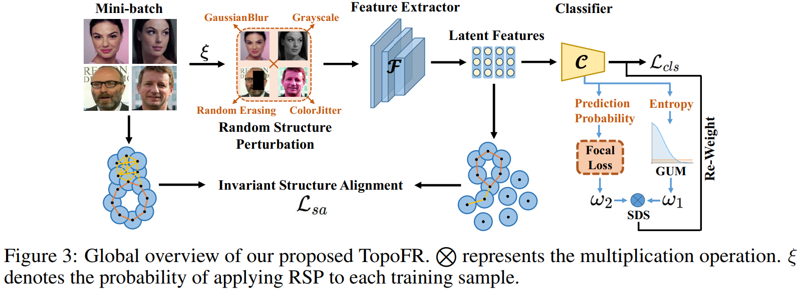

<h2 align="center">TopoFR: A Closer Look at Topology Alignment on Face Recognition
<h5 align="center"> If you like TopoFR, please give us a star ⭐ on GitHub for the latest update~
<h5 align="center"> <a href='https://huggingface.co/spaces/developer0hye/TopoFR-Face-Recognition'></a>
  
</h2>

This is the official PyTorch implementation of ["[NeurIPS 2024] TopoFR: A Closer Look at Topology Alignment on Face Recognition"](https://proceedings.neurips.cc/paper_files/paper/2024/hash/419b6c974712adb884bfbbeea8e94d1b-Abstract-Conference.html).


[[Arxiv Version]](https://arxiv.org/abs/2410.10587) [[Code in FaceChain Rep.]](https://github.com/modelscope/facechain/tree/main/face_module/TopoFR)[[机器之心]](https://www.jiqizhixin.com/articles/2024-10-17-6) [[CVer]](https://mp.weixin.qq.com/s/3NegnpJUGPfI_dOfkp_4LQ) [[CSDN]](https://blog.csdn.net/sunbaigui/article/details/143230746?spm=1001.2014.3001.5502)



## Requirements
* Install Pytorch (torch>=1.9.0)
* ```pip install -r requirement.txt```

## Datasets
You can download the training datasets, including MS1MV2 and Glint360K:
* MS1MV2: [Google Drive](https://drive.google.com/file/d/1SXS4-Am3bsKSK615qbYdbA_FMVh3sAvR/view)
* Glint360K: [Baidu](https://pan.baidu.com/share/init?surl=GsYqTTt7_Dn8BfxxsLFN0w) (code=:o3az)

You can download the test dataset IJB-C as follows:
* IJB-C: [Google Drive](https://drive.google.com/file/d/1aC4zf2Bn0xCVH_ZtEuQipR2JvRb1bf8o/view) 

## How to Train Models
1. You need to modify the path of training dataset in every configuration file in folder configs.

2. To run on a machine with 4 GPUs:
```
python -m torch.distributed.launch --nproc_per_node=4 --nnodes=1 --node_rank=0 --master_addr="127.0.0.1" --master_port=12581 train.py 
```

## Hugging Face
You can easily experience our model on the Hugging Face space:
<a href='https://huggingface.co/spaces/developer0hye/TopoFR-Face-Recognition'></a>

## How to Test Models
1. You need to modify the path of IJB-C dataset in eval_ijbc_ms1mv2.py and eval_ijbc_glint360k.py.

2. Run:
```
python eval_ijbc_ms1mv2.py --model-prefix work_dirs/ms1mv2_r50/model.pt --result-dir work_dirs/ms1mv2_r50 --network r50 > ijbc_ms1mv2_R50_TopoFR.log 2>&1 &
```
```
python eval_ijbc_glint360k.py --model-prefix work_dirs/glint360k_r50/model.pt --result-dir work_dirs/glint360k_r50 --network r50 > ijbc_glint360k_R50_TopoFR.log 2>&1 &
```

## TopoFR Pretrained Models 

* You can download the TopoFR models reported in our paper as follows:

Verification accuracy (%) on IJB-C benchmark. † denotes TopoFR trained by CosFace.
| Training Data | Model| IJB-C(1e-5) | IJB-C(1e-4) |
| ------ | ------ | ------ | ------ |
| MS1MV2 | [R50 TopoFR†](https://drive.google.com/file/d/1mMikKUtmMXSB8COQ8BzEh3x3u2296UHP/view?usp=sharing) | 94.79 | 96.42 |
| MS1MV2 | [R50 TopoFR](https://drive.google.com/file/d/1Q2ux_leUHni9zYQ-5i2zL09yGWaeJZkX/view?usp=sharing) | 94.71 | 96.49 |
| MS1MV2 | [R100 TopoFR†](https://drive.google.com/file/d/17A0M413lt8cFX4uuRvvpaKy5EZE5--yl/view?usp=sharing) | 95.28 | 96.96 |
| MS1MV2 | [R100 TopoFR](https://drive.google.com/file/d/1a648DCItUZpolxvMMrUHZ6OR_O5hebfT/view?usp=sharing) | 95.23 | 96.95 |
| MS1MV2 | [R200 TopoFR†](https://drive.google.com/file/d/1BuF1qU60w0y31Fddmmcl_YUbcpsj6WoF/view?usp=sharing) | 95.19 | 97.12 |
| MS1MV2 | [R200 TopoFR](https://drive.google.com/file/d/14zStJMpXgP-vx_9slj-gBCRapzU_zRrV/view?usp=sharing) | 95.15 | 97.08 |

| Training Data | Model | IJB-C(1e-5) | IJB-C(1e-4) |
| ------ | ------ | ------ | ------ |
| Glint360K | [R50 TopoFR](https://drive.google.com/file/d/1R_ffZ2GpvNrwG5ZM76LO32KTol-hXNQx/view?usp=sharing) | 95.99 | 97.27 |
| Glint360K | [R100 TopoFR](https://drive.google.com/file/d/1vQBGXc_nXytEx8fpV9jykeLdxD45cE8B/view?usp=sharing) | 96.57 | 97.60 |
| Glint360K | [R200 TopoFR](https://drive.google.com/file/d/1DXvcksXIaIXoNWxTXPWhLQaKL_aPaBAR/view?usp=sharing) | 96.71 | 97.84 |

* You can test the accuracy of these model: (e.g., Glint360K R100 TopoFR)
```
python eval_ijbc_glint360k.py --model-prefix work_dirs/glint360k_r100/Glint360K_R100_TopoFR_9760.pt --result-dir work_dirs/glint360k_r100 --network r100 > ijbc_glint360k_R100_TopoFR.log 2>&1 &
```

## Citation
* If you find it helpful for you, please consider citing our paper 📝 and giving a star ⭐.
```
@article{dan2024topofr,
  title={Topofr: A closer look at topology alignment on face recognition},
  author={Dan, Jun and Liu, Yang and Deng, Jiankang and Xie, Haoyu and Li, Siyuan and Sun, Baigui and Luo, Shan},
  journal={Advances in Neural Information Processing Systems},
  volume={37},
  pages={37213--37240},
  year={2024}
}
```

## Acknowledgments
We thank Insighface for the excellent [code base](https://github.com/deepinsight/insightface/tree/master/recognition/arcface_torch).  
We would like to express our gratitude to the researcher [@developer0hye](https://github.com/developer0hye) for providing an outstanding [HF demo](https://huggingface.co/spaces/developer0hye/TopoFR-Face-Recognition).
